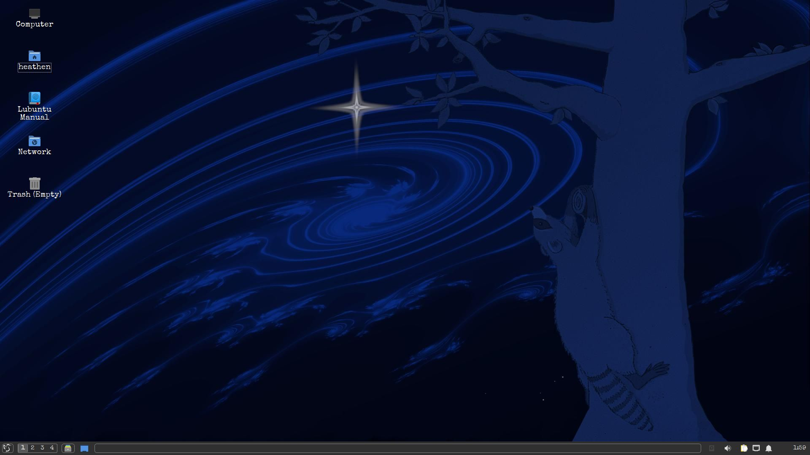

Not strictly an Odin update, but I may seriously switch away from Budgie. Some of it is my fault: I didn't need extras for a system that is mostly to
follow the course, and I should have gone with the minimal install. But now as I'm trying to remove the bloat (and I do mean bloat! Why do I have card
games mahjong etc etc?? Sorry, I didn't know this was a windows distro *yikes*) it keeps locking me out of uninstall, which I have figured out how to
troubleshoot but I don't want to have to for each. and every. single. program I try to uninstall. I've also had to reset bashrc 3 times since I set the whole thing up, despite the fact I haven't touched the file at all except when forced to by it getting messed up out of nowhere, and it forgets my resolution several times per session. If I were new to linux or running linux through a vm, I would assume user error, but I've been running linux since I was a kid and I have never had an experience quite like this before. (Oh I had crashes, but they were my fault for doing dumb things while trying to be cool and customise ALL the parts of my system without really knowing what I was messing with. But this and that are not nearly the same thing.)

I am going to try a fresh install on the mimimal option just to say I gave it a truly fair shot, but I'm also currently downloading Kylin and Lubuntu, as
I looked at both Kylin Desktop and LXQT when setting up my GUI WSL, and since they're official flavors and I'm not sure Budgie is gonna work out now seems
as good as any time to go ahead and give them a try.

#### Update: It's a tie (sort of) ####
My first thought loading into Kylin: wow. My second thought: WOW! My third thought: there's no way this is ubuntu, I'm being trolled rn. Unfortunately while the live cd worked great, after
installing and loading it back up it quickly became obvious that my PC was simply not having it. On top of that, ukui crashes often, which would get annoying to deal with the errors popping up while
I'm working on project stuff, and that's best-case scenario where it doesn't also crash my editor with it and take any unsaved code. It seems to be a virtualbox thing, but there's not a lot of documentation out there on running it on virtual boxes and the fixes I did find didn't work. I played with it for a while and got it much better, but not good. So I installed it on a virtualbox on my laptop where it still has the crashing problem, mostly on boot, but runs great otherwise. I am seriously considering trying it as the main OS on my other laptop once the harddrive on that one gets fixed. The plan *was* to make it my Pop! box, but... idk I'm really liking Kylin. Might go with openKylin though if I do go that route, but idk yet.

Lubuntu had a similar experience of loading in and immediately taking a second to appreciate that it doesn't look like an OS that already looked severly outdated in the early 2000s. (Sorry ubuntu fanboys. Do those even exist?) It also ran great on the live cd but I was feeling pretty skeptical at this point so I tried not to get my hopes up. Install was a smoother process than Kylin, stuck to the minimal, opened it up and it... works? lol, runs pretty great and the only thing I HAD to tweak was turning off window animations because they turned my screen into a slideshow. So unless any craziness comes up, it looks like this is gonna be my main driver for the rest of the course. Spent a while customising it and I gotta say, the amount of options on here is incredible and makes it even harder to believe I'm on an ubuntu system rn.

I reinstalled VS Codium, taking the time to figure out how to do it through the command line this time so that
opening it by typing "codium" just works with no extra setup, but I went a different route with the browser
and installed Ungoogled Chromium this time. I've never used it but I figure this is following along
closer than my previous solution of using Brave was.

